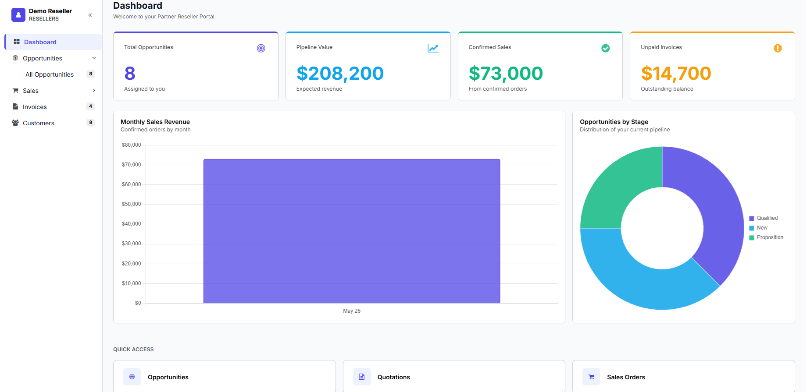
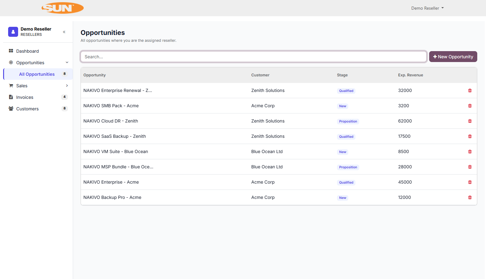
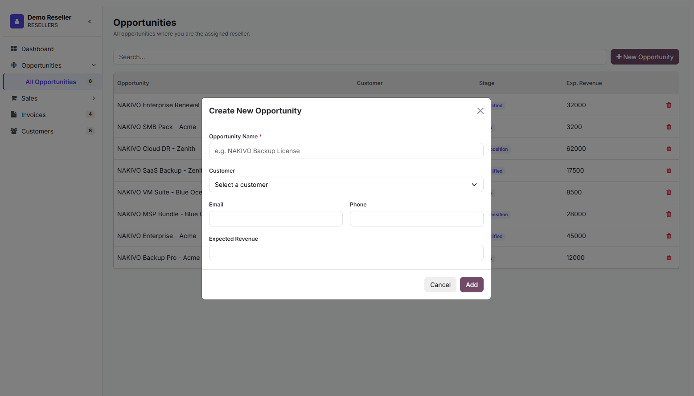

# Partner Reseller Portal for Odoo 19

Authenticated reseller portal built on **Odoo 19 Community Edition** with an Odoo-native stack:

- Odoo portal page for authenticated access
- Owl frontend for the reseller dashboard UI
- REST-style HTTP JSON endpoints for portal reads and actions
- strict backend-enforced reseller data isolation

## Description

Authenticated reseller portal built on Odoo 19 Community Edition with an Odoo-native stack.

**Features:**

- Portal page at `/my/reseller-portal` — accessible to reseller portal users only
- Owl SPA dashboard exposing opportunities, quotations, sales orders, invoices, and customers
- Authenticated JSON endpoints to list, create, and delete reseller-owned opportunities
- Backend-enforced data isolation — scope is derived from the session, never from client payloads
- `nakivo_base_rest` — reusable REST primitives (Pydantic validation, error envelopes, exception mapping) decoupled from reseller-specific logic

## SCREENSHOTS

### Dashboard overview



### Opportunities list



### Create opportunity modal



## Design decisions

Key architectural choices are documented in [`DECISIONS.md`](DECISIONS.md). A short summary:

| Decision           | Choice                                            | Rationale                                                                                        |
| ------------------ | ------------------------------------------------- | ------------------------------------------------------------------------------------------------ |
| Frontend framework | Owl SPA inside Odoo portal shell                  | Reuses Odoo session auth, CSRF, and asset pipeline — no separate frontend server needed          |
| Backend API style  | `type='http'` routes returning JSON               | Keeps CSRF handling standard and avoids jsonrpc overhead for simple REST semantics               |
| Data isolation     | Scope resolved from `request.env.user.partner_id` | Client-supplied identifiers are never trusted; server is the single trust boundary               |
| Addon split        | `nakivo_base_rest` + `nakivo_reseller_portal`     | Generic REST primitives are reusable across addons; domain logic stays isolated                  |
| UI reference       | Softr Partner Portal template                     | Establishes familiar B2B portal UX patterns (collapsible sidebar, toolbar + table, create modal) |
| Create form        | Modal overlay, not a dedicated route              | Short form — modal keeps the user in the list context; revisit if the form grows beyond 8 fields |

See [`DECISIONS.md`](DECISIONS.md) for the full rationale behind each decision.

## Overview

This repository is currently organized around two related addons:

- `nakivo_base_rest/` — reusable Pydantic-first REST primitives for Odoo addons
- `nakivo_reseller_portal/` — reseller-specific portal UI, business logic, and API endpoints

The implementation follows a deliberately simple architecture:

```text
Portal user login
	↓
Open /my/reseller-portal
	↓
Odoo renders the page shell
	↓
Owl app mounts in the portal content area
	↓
Frontend calls authenticated JSON endpoints
	↓
Backend resolves reseller from the session and enforces ownership
```

## Repository structure

```text
nakivo-test/
├── .github/                     # instructions + CI workflows
├── docker/                      # local Odoo/Postgres compose config
├── Dockerfile                   # Odoo 19 image with runtime requirements
├── nakivo_base_rest/            # shared REST foundation addon
├── docs/                        # project conventions, API, security, design notes
├── nakivo_reseller_portal/      # reseller portal addon
├── .editorconfig
├── .pre-commit-config.yaml
├── .pylintrc
├── .pylintrc-mandatory
├── .ruff.toml
├── eslint.config.cjs
├── requirements.txt
└── requirements-dev.txt
```

## Addons

### `nakivo_base_rest`

Provides shared API primitives:

- request parsing helpers
- Pydantic-based request validation
- centralized exception mapping
- standardized success and error envelopes
- semantic error codes with numeric values

### `nakivo_reseller_portal`

Implements the reseller-facing flow:

- portal page at `/my/reseller-portal`
- reseller-scoped dashboard data
- reseller-scoped opportunity creation
- reseller-scoped opportunity deletion
- Owl frontend assets loaded in `web.assets_frontend`

## API contract highlights

The authenticated API uses `type='http'` routes returning JSON via `request.make_json_response()`.

Error responses follow this envelope:

```json
{
  "success": false,
  "error": {
    "code": 404,
    "name": "OPPORTUNITY_NOT_FOUND",
    "message": "Opportunity not found"
  }
}
```

See the full contract in `docs/api.md`.

## Security principles

The backend is the trust boundary.

- never trust reseller identifiers from frontend payloads
- always derive reseller scope from the authenticated session
- apply restrictive domains before any `sudo()` access
- sanitize unexpected backend failures before returning them to the client

See `docs/security.md` for the threat model and forbidden patterns.

## Documentation map

- `AGENTS.md` — root instructions for coding agents working in this repo
- `docs/conventions.md` — architecture and implementation rules
- `docs/design.md` — frontend visual contract for agent-generated UI
- `docs/api.md` — endpoint and payload design
- `docs/security.md` — security boundaries and data-isolation rules
- `docs/ai-usage.md` — AI usage notes for the assignment

## Installation

### Prerequisites

- Docker >= 20.10.0
- Docker Compose >= 2.0.0
- Git

### Getting started

#### 1. Clone the repository

```bash
git clone https://github.com/donhat-dev/nakivo-test.git nakivo-test
cd nakivo-test
```

#### 2. Prepare the environment file

Copy `.env.example` to `.env` and adjust values if needed:

```bash
cp docker/.env.example docker/.env   # macOS / Linux
```

Default variables:

| Variable                | Default |
| ----------------------- | ------- |
| `ODOO_HTTP_PORT`        | `8069`  |
| `ODOO_LONGPOLLING_PORT` | `8072`  |
| `DEBUGPY_PORT`          | `5678`  |

#### 3. Start the services

```bash
cd docker
docker compose up -d --build
```

This creates two services:

- **db** — PostgreSQL
- **odoo** — Odoo 19 Community with both addons mounted

#### 4. Install the addons

```bash
docker compose run --rm odoo odoo \
    --config=/etc/odoo/odoo.conf \
    -d nakivo_crm \
    -i nakivo_base_rest,nakivo_reseller_portal \
    --stop-after-init
```

#### 5. Access the application

| Service         | URL                                 |
| --------------- | ----------------------------------- |
| Odoo web        | `http://localhost:8069`             |
| Longpolling     | port `8072`                         |
| Debug (debugpy) | port `5678` (debug compose variant) |

## Use cases / context

This module provides the data isolation layer and self-service portal for reseller partners. A reseller can log into the standard Odoo portal and access a dashboard scoped strictly to their own data — no access to other resellers' opportunities, orders, invoices, or customers — without requiring a full Odoo internal user license.

Typical scenarios:

- A reseller logs in and reviews their open opportunities and expected revenue.
- A reseller creates a new opportunity directly from the portal without contacting the internal sales team.
- A reseller monitors the status of their linked customers' invoices and sales orders.

## Configure

### 1. Mark reseller partners

In the back office, open the `res.partner` record for the partner acting as a reseller and enable the **Is Reseller** checkbox.

### 2. Link records to the reseller

Set the **Reseller Partner** field on the relevant `crm.lead`, `sale.order`, `account.move`, and `res.partner` (customer) records to associate them with the reseller.

### 3. Grant portal access

1. Go to **Settings → Users & Companies → Users**.
2. Use the standard **Grant portal access** action to create a portal user linked to the reseller partner.
3. Add the portal user to the **Reseller Portal User** group (`nakivo_reseller_portal.group_reseller_portal_user`).

### 4. Verify access

Log in with the reseller portal user and navigate to `/my/reseller-portal`. The Owl dashboard should load showing only the reseller's own data.

## Usage

### Basic flow

1. Log in as a **Reseller Portal User**.
2. Navigate to `/my` — the **Reseller Dashboard** tile appears on the portal home page.
3. Click the tile (or go directly to `/my/reseller-portal`) to open the Owl SPA dashboard.

### Dashboard

The dashboard shows summary cards for Opportunities, Quotations, Sales Orders, Invoices, and Customers — each with a count and a shortcut to the corresponding list view.

### Opportunity management

- Select **Opportunities** in the sidebar to view the full list.
- Click **+ New Opportunity** in the toolbar to open the create modal. Fill in the name, expected revenue, deadline, and optionally assign a customer from the reseller's customer list.
- Click the **delete** (trash) icon on any row to remove an opportunity. A confirmation step is shown before the delete is executed.

### Navigation

The sidebar groups **Sales** into Quotations and Sales Orders. Opportunities, Invoices, and Customers are top-level items. All views are client-side — no full page reload occurs when switching sections.

## Requirements

### Runtime

- Python 3.10+
- Odoo 19 Community Edition
- `pydantic>=2.8,<3.0`

Install runtime dependency:

```bash
python3 -m pip install -r requirements.txt
```

For Docker-based local development, the compose stack builds the repository
`Dockerfile`, installs `requirements.txt`, and writes Odoo logs to
`docker/logs/odoo-server.log` with logrotate configured:

```bash
cd docker
docker compose up -d --build
```

### Development tooling

Install development tooling for local quality checks:

```bash
python3 -m pip install -r requirements-dev.txt
pre-commit install
```

## Quality checks

This repository now includes a lightweight quality toolchain inspired by `mvillage-test` and adapted for the current Odoo 19 addon layout:

- `ruff` for Python linting and formatting
- `pylint-odoo` for Odoo-specific static checks
- `prettier` for Markdown / YAML / XML / frontend assets
- `eslint` for JavaScript files
- GitHub Actions workflow running `pre-commit`

Run all local checks:

```bash
pre-commit run --all-files
```

Quick syntax validation for both addons:

```bash
python3 -m compileall nakivo_base_rest nakivo_reseller_portal
```

## Credits

The addon-level `README.rst` files are auto-generated following OCA conventions. To update addon documentation, edit the fragments under `nakivo_reseller_portal/readme/` or `nakivo_base_rest/readme/` rather than modifying `README.rst` directly.

- License: [LGPL-3.0](LICENSE)

## Authors

- donhat-dev

## Contributors

- Don Hat — <donhat.hn@gmail.com>

```

```
